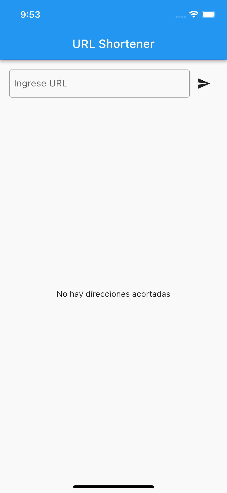

# Flutter NuBank coding exercise

This project was developed as a coding exercise for a technical interview for a Flutter position in NuBank.

## Description

This exercise aims at creating a small application that allows you to shorten links and displays a history of the recently shortened links to your favorite websites.

In order to do this, you'll use an already implemented service that will handle all the backend logic, which is to accept the links and return an alias for them.

This application is composed of only one screen.

It has:
- One text input in which the user can type the website URL to shorten;
- One button which will trigger the action of sending this link to the service;
- A list with the recently shortened links/aliases.

## Screenshots

Empty Screen | Request Sent
--- | ---
 | 